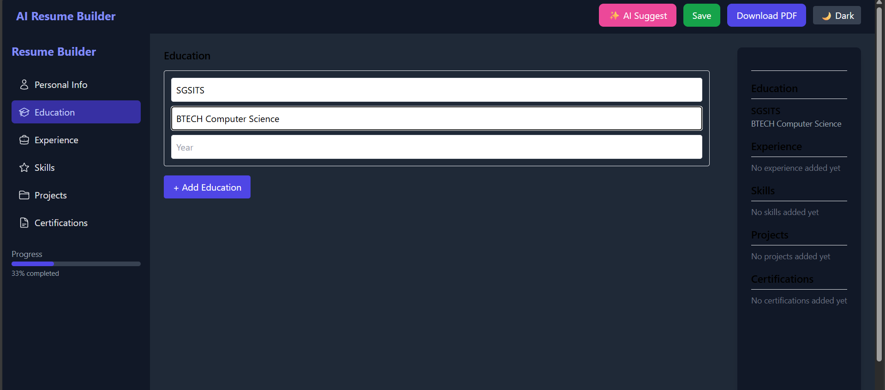

# AI Resume Builder

An **AI-powered Resume Builder** that helps users create professional, ATS-friendly resumes with real-time improvement suggestions from OpenAI.  

**Live Demo (optional if deployed)**: [Add your link here]  
**GitHub Repo**: [AI-Resume-Builder](https://github.com/lavanya-jain13/AI-Resume-Builder)

---

##  Features
-  **AI Resume Suggestions** – Improve your resume instantly with OpenAI-powered feedback.  
-  **Modern UI** – Clean, responsive design with Light/Dark mode.  
-  **Live Preview** – See changes reflected instantly in a formatted resume.  
-  **Resume Sections** – Add/Edit:  
  - Personal Info  
  - Education  
  - Experience  
  - Skills (taxonomy-based suggestions)  
  - Projects  
  - Certifications  
-  **Save & Export** – Download your resume as PDF.  
-  **Full-Stack Integration** – React + Node.js + MongoDB + OpenAI API.  

---

##  Tech Stack

### Frontend
-  React (CRA)  
-  Tailwind CSS  
-  HeroIcons, Lucide React  

### Backend
-  Node.js, Express.js  
-  MongoDB with Mongoose  
-  OpenAI API for AI suggestions  

---

##  Installation & Setup

### 1. Clone the repository
```bash
git clone https://github.com/lavanya-jain13/AI-Resume-Builder.git
cd AI-Resume-Builder

2. Setup Backend

cd resume-builder-backend
npm install


Create a .env file in resume-builder-backend/:
MONGO_URI=your_mongodb_connection_string
OPENAI_API_KEY=your_openai_api_key
PORT=5000

Run the backend:
npm start

3. Setup Frontend
cd ../resume-builder-frontend
npm install
npm start

## Screenshots


Author

Lavanya Jain
